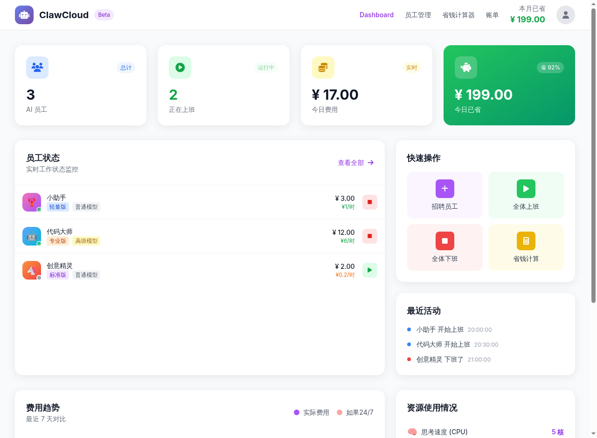
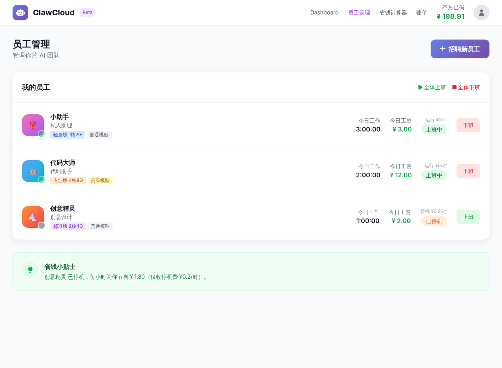
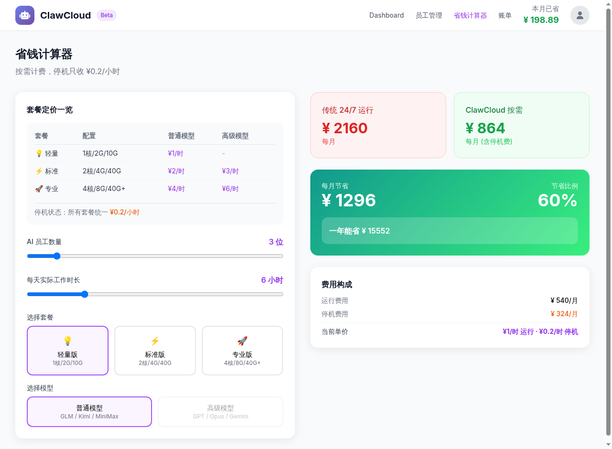
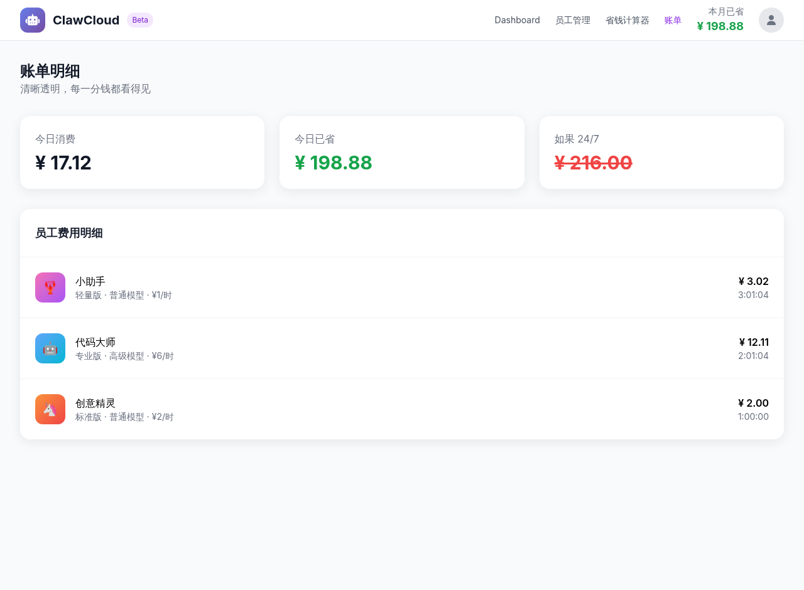

<div align="center">

# ☁️ ClawCloud Web

**AI Employee Management Dashboard — Deploy, manage, and optimize AI workers on demand.**

[](https://github.com/ruilong1999/clawcloud-web)
[](https://tailwindcss.com)
[](LICENSE)
[](https://nginx.org)

</div>

---

## Overview

**ClawCloud** is a cloud AI workforce management platform that lets you hire, deploy, monitor, and stop virtual AI workers on a flexible pay-as-you-go model.

Instead of running AI instances 24/7, you only pay full rates when your AI employees are actively working. When idle, costs drop to a minimal standby rate — delivering significant savings versus traditional always-on infrastructure.

> Built as a fully self-contained single-page application with no build step required.

---

## Screenshots

| Dashboard | Employee Management |
|---|---|
|  |  |

| Savings Calculator | Billing Breakdown |
|---|---|
|  |  |

---

## Features

### Dashboard
- Live summary cards — total AI workers, active instances, daily cost, daily savings
- Resource utilization bars for CPU cores, memory (GB), and storage (GB)
- 7-day cost trend chart with efficiency score and animated progress rings

### Employee Management
- Full worker roster with status indicators (running / idle)
- Start and stop individual AI workers with one click
- **Hire New AI Staff** modal — set name, specialization, tier, and model
- Animated deployment effect on hire
- Per-employee detail view

### Savings Calculator
- Interactive sliders for number of employees, daily work hours, and tier
- Side-by-side comparison of traditional 24/7 cost vs. ClawCloud on-demand cost
- Monthly and annual savings projection

### Billing
- Itemized daily cost breakdown per employee
- Actual cost vs. hypothetical full-time cost comparison
- Per-employee work duration, hourly rate, and savings differential

---

## Pricing Model

| Tier | vCPU | Memory | Storage | Standard Model | Advanced Model | Idle Rate |
|---|---|---|---|---|---|---|
| 💡 Lite | 1 | 2 GB | 10 GB | ¥1/hr | — | ¥0.2/hr |
| ⚡ Standard | 2 | 4 GB | 40 GB | ¥2/hr | ¥3/hr | ¥0.2/hr |
| 🚀 Professional | 4 | 8 GB | 40 GB+ | ¥4/hr | ¥6/hr | ¥0.2/hr |

**Standard models:** GLM, Kimi, MiniMax
**Advanced models:** GPT, Claude Opus, Gemini *(Standard and Professional tiers only)*

---

## Tech Stack

| Layer | Technology |
|---|---|
| Markup | HTML5 |
| Styling | Tailwind CSS (CDN) |
| Logic | Vanilla JavaScript |
| Icons | Font Awesome 6.5.1 |
| Typography | Google Fonts |
| Web Server | Nginx with Let's Encrypt TLS |

No build tools, no npm, no framework — open `index.html` and it runs.

---

## Getting Started

### Local Preview

```bash
git clone https://github.com/ruilong1999/clawcloud-web.git
cd clawcloud-web
open index.html
```

---

## License

MIT License - see [LICENSE](LICENSE) for details.
